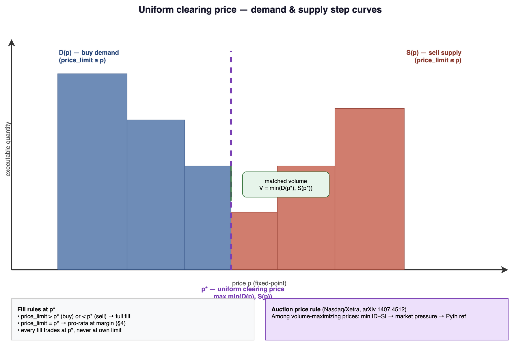
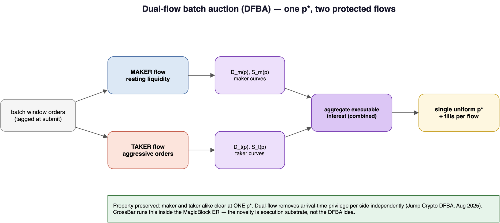
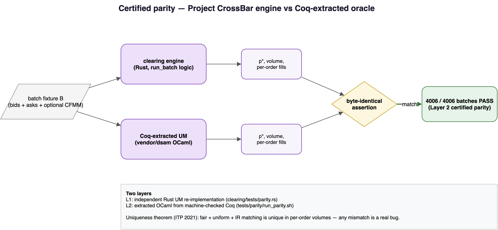

# MATH.md — Clearing Price, Dual-Flow, and the Verified Matcher

This file specifies the auction mathematics precisely enough to implement `run_batch` and test it against a formally verified oracle. Read [`TECHNICALDESIGN.md`](TECHNICALDESIGN.md) for the on-chain account model and instruction surface.

---

## 0. Notation

| Symbol | Meaning |
| --- | --- |
| Batch | Orders whose batch window equals the current tick |
| Order | Tuple $(\text{side}, p_{\lim}, q, \text{id})$ — side is buy or sell; $p_{\lim}$ is the worst acceptable price (max for buy, min for sell); $q$ is base quantity |
| $p^*$ | Single **uniform clearing price** for the batch |
| $V$ | Matched volume at $p^*$ |
| Prices | Integers in quote units per base unit at scale `PRICE_SCALE = 10^6` — **no floats** on-chain |

---

## 1. Frequent batch auctions — the why

The seminal argument is Budish, Cramton & Shim, *The High-Frequency Trading Arms Race: Frequent Batch Auctions as a Market Design Response*. A continuous limit order book rewards whoever reaches the matching engine first, turning market quality into a latency race. A **frequent batch auction (FBA)** collects orders over a short discrete window and clears them together at one price — within the window there is no first-mover advantage; competition moves from time to price.

The MEV framing appears in the SoK on MEV countermeasures ([arXiv:2212.05111](https://arxiv.org/pdf/2212.05111)): FBAs are a market-design countermeasure. On-chain instances (CoW Swap, Fair-TraDEX) outsource settlement to competing solvers. **Project CrossBar** runs the clear itself inside an Ephemeral Rollup as a deterministic on-protocol function.

---

## 2. Uniform clearing price — single side pair



Construct two step functions over price $p$:

$$
D(p) = \sum_{\text{buy orders } i:\, p_{\lim}^{(i)} \ge p} q_i
\qquad\text{(non-increasing in } p \text{)}
$$

$$
S(p) = \sum_{\text{sell orders } j:\, p_{\lim}^{(j)} \le p} q_j
\qquad\text{(non-decreasing in } p \text{)}
$$

The clearing price $p^*$ maximizes executable overlap:

$$
p^* \in \arg\max_{p}\; \min\bigl(D(p),\, S(p)\bigr)
$$

$$
V = \min\bigl(D(p^*),\, S(p^*)\bigr)
$$

Because both curves are step functions over the finite set of limit prices in the batch, the crossing is found by sorting distinct limit prices and walking them. The crossing may be a single price or a flat interval; if it is an interval, apply the auction price rule in [§8](#8-auction-price-determination-research-backed-price-formation) (identical to the oracle's rule, or differential tests will flag a false mismatch).

**Fill rules at $p^*$:**

| Condition | Fill |
| --- | --- |
| Buy with $p_{\lim} > p^*$ | Full fill (up to $V$) |
| Sell with $p_{\lim} < p^*$ | Full fill (up to $V$) |
| Order at margin ($p_{\lim} = p^*$) | Pro-rata share of residual volume ([§4](#4-pro-rata-at-the-margin-and-the-vrf-tie-break)) |
| All filled orders | Trade at **$p^*$**, never at own limit — the **single-price fairness guarantee** |

---

## 3. Dual-flow batch auction



The dual-flow construction follows Jump Crypto's [Dual Flow Batch Auction](https://jumpcrypto.com/resources/dual-flow-batch-auction) (Aug 2025). Instead of one combined auction, run two independent auctions each tick — one over **maker** flow, one over **taker** flow — and cross them at a single fair clearing price.

**Implementation:**

1. Tag each order as maker or taker at submit time (`flow` flag on `OpenOrders`; see `TECHNICALDESIGN.md`).
2. Build demand/supply curves per flow: $D_m, S_m$ and $D_t, S_t$.
3. Aggregate executable interest; compute one $p^*$; fill each flow at that price.

**Property preserved:** a single $p^*$ for the whole batch — maker and taker alike. Dual-flow changes how interest is aggregated and protected, not the single-price outcome.

Prior art on base L1: Archer Exchange uses DFBA on a base-L1 CLOB. CrossBar's contribution is running DFBA clearing **inside an Ephemeral Rollup**, not inventing DFBA.

---

## 4. Pro-rata at the margin and the VRF tie-break

At the marginal price level, total quantity wanting to trade can exceed residual matched volume. Allocate pro-rata by quantity:

$$
\text{fill}_i = \left\lfloor \frac{R \cdot q_i}{\sum_{j \in \mathcal{M}} q_j} \right\rfloor
$$

where $R$ is the residual volume at $p^*$ and $\mathcal{M}$ is the set of marginal orders.

Flooring leaves an indivisible remainder of a few base units. Assign that remainder by a **VRF-determined order** over tied orders (`ephemeral-vrf`: request then consume callback). VRF touches **only** this remainder — it never influences $p^*$ or any non-marginal fill.

If VRF does not return in time, fall back to deterministic canonical order (lowest `order_id` first) and flag the batch. The fairness cost of the fallback is bounded to a remainder of a few units.

> **Blast-radius control:** VRF is kept off the price path because the library is not audited.

---

## 5. The impossibility tradeoff

From Natarajan, Sarswat, Singh, *Verified Double Sided Auctions for Financial Markets*, ITP 2021 ([arXiv:2104.08437](https://arxiv.org/abs/2104.08437)): no single matching algorithm can simultaneously be

- **fair**
- **uniform** (single price)
- **individually rational**
- **maximal** (maximum matched volume)

Real exchanges sacrifice maximality and choose fair + individually rational + uniform-price matching. CrossBar makes the same deliberate choice. The crossing rule in [§2](#2-uniform-clearing-price--single-side-pair) and the marginal-interval rule must match the fair-uniform-IR matching configured on the oracle.

---

## 6. The verified matcher as a correctness oracle



The TIFR group has machine-checked auction matchers in Coq with extraction to OCaml:

| Paper | Contribution |
| --- | --- |
| Sarswat & Singh, ICFEM 2020 ([arXiv:2007.10805](https://arxiv.org/abs/2007.10805)) | Uniform-price and maximum-matching properties |
| Natarajan, Sarswat, Singh, ITP 2021 ([arXiv:2104.08437](https://arxiv.org/abs/2104.08437)) | Double-sided auctions with multiplicity; uniqueness theorems |
| Garg & Sarswat, 2024 ([arXiv:2412.08624](https://arxiv.org/abs/2412.08624)) | Verified continuous double auction (less central here) |

**Primary oracle repo:** [github.com/suneel-sarswat/dsam](https://github.com/suneel-sarswat/dsam) — double-sided auctions with multiplicity (the batch/call-auction case).

### 6.1 The differential test

For each batch fixture $B$:

$$
\text{on\_chain}(B) = \text{fills from } \texttt{run\_batch}(B) \text{ read from BatchResult}
$$

$$
\text{oracle}(B) = \text{fills from extracted verified matcher on } B
$$

**Assert:**

1. $p^*$ matches
2. Per-order filled quantity matches for every `order_id`

By the uniqueness theorem, a correct fair-uniform-IR matching is unique in per-order volumes — any mismatch is a real bug, not a tie-break artifact.

Generate fixtures three ways: hand-written edge cases, property-based random batches, and (optionally) replayed market depth. At the marginal tie-break, assert on $p^*$ and total $V$, not on remainder assignment.

**Evidence:** `4006/4006` batches pass certified Layer-2 parity (`./tests/parity/run_parity.sh`).

On devnet, the deployed program (`CG4brtfmRvvHLGEfLazSmrTWeUJsDvyKYfosx2Abbzbd`) is validated on the live MagicBlock ER via `tests/er-demo.ts` and `tests/crank-demo.ts`. See [`README.md`](README.md#devnet-deployment).

---

## 7. MEV-elimination argument

**Claim:** within a batch, there is no profit from transaction ordering.

**Sketch:** `run_batch` is a pure deterministic function of the batch set and reference price. It discards arrival order (sorts by price, never by time). Every matched order clears at the same $p^*$. Therefore inserting, reordering, or sandwiching transactions inside one window cannot produce a better price for the attacker or a worse price for the victim than $p^*$. A sandwich that brackets a victim inside the same window fills at the same $p^*$ — it captures nothing.

Residual cross-batch games are bounded by tick frequency and the Pyth Lazer reference band:

$$
p^* \in \bigl[p_{\text{ref}}(1-\delta),\; p_{\text{ref}}(1+\delta)\bigr]
$$

rejecting clears outside the band so a thin or stale book cannot be manipulated.

---

## 8. Auction price determination (research-backed price formation)

Sections 2 and 5 pin matched volume and per-order fills. They do not pin the single number printed as $p^*$: any price in the crossing interval $[p_s, p_b]$ (marginal seller .. marginal buyer) is fair, uniform, and individually rational — and crucially, the choice inside that interval **does not change** $V$ or any per-order fill.

CrossBar implements the **canonical call-auction price determination** (Nasdaq opening/closing cross; Deutsche Börse Xetra). Among volume-maximizing prices:

1. **Minimize imbalance** $|D(p) - S(p)|$
2. **Market pressure:** if tied, heavy side tilts price (buy-heavy → higher, sell-heavy → lower)
3. **Reference price:** if still balanced, anchor to Pyth Lazer mid (clamped into the interval)

Implementation: `ClearingRule::Auction(Option<p_ref>)`, `clear::auction_clearing_price`. Result is always inside $[p_s, p_b]$; matched volume + fills are byte-identical to the verified-matcher rule.

### 8.1 Randomized clearing time (implemented)

Source: Mastrolia & Xu, [arXiv:2405.09764](https://arxiv.org/abs/2405.09764). With a fixed, predictable close, a strategic trader's optimal arrival is the last instant ("bang the close"); randomizing the close flips that optimum. In their Bernoulli $\{9,10\}$ model, an $\approx 8\%$ chance of closing one tick early already moves the optimum off the last instant.

CrossBar randomizes the close by counting crank ticks per window and closing after a VRF-derived target drawn uniformly from $[\texttt{window\_min\_ticks}, \texttt{window\_max\_ticks}]$. Implementation: `clearing/src/window.rs`, `request_window_vrf` / `consume_window_vrf`.

**N1 preserved:** the gate is window *formation* (which orders fall in a batch) — it reads only an instruction counter and the VRF target, never clock, slot, or arrival order.

### 8.2 Order fairness — subsumed by set-determinism (deliberately NOT implemented)

Wendy (Kursawe, [arXiv:2007.08303](https://arxiv.org/abs/2007.08303)) and Libra (Mavroudis & Melton, [arXiv:1910.00321](https://arxiv.org/abs/1910.00321)) guarantee properties about how **arrival order** maps to execution priority. Both presuppose outcomes that depend on order (continuous, time-priority books).

An FBA removes that dependency. Formally, for any permutation $\pi$ of batch $B$:

$$
\text{run\_batch}(B) = \text{run\_batch}(\pi(B))
$$

identical $p^*$, $V$, and per-order fills. This is **stronger** than Libra's bounded-but-nonzero or Wendy's block-relative fairness.

CrossBar deliberately does **not** add a receive-order fairness layer — it would feed sequence into matching and violate **N1**. Enforced by `clearing/tests/order_fairness.rs` (~20k random batches).

### 8.3 CFMM backstop liquidity (implemented)

Source: Ramseyer, Goyal, Goel & Mazières, EC'24 ([arXiv:2210.04929](https://arxiv.org/abs/2210.04929)). A constant-product pool folds into a uniform-price batch clear: the pool behaves as a smooth curve added to order demand/supply; everyone trades at one $p^*$.

CrossBar discretizes a constant-product pool ($x \cdot y = k$) into synthetic maker limit orders (a "ladder") and hands them to the unchanged matcher (`clearing/src/cfmm.rs`). The new numeric primitive is integer square root:

$$
x(p) = \left\lfloor \sqrt{\frac{k \cdot \text{PRICE\_SCALE}}{p}} \right\rfloor
$$

**Verifiability** (`clearing/tests/cfmm.rs`):

- Zero reserves ⇒ byte-identical to baseline auction (4006/4006 parity untouched)
- Thin books clear against the pool; $k$ never decreases (pool individual rationality)
- N1-clean: ladder depends only on $(\text{reserves}, \text{band})$, not arrival order

Companion metric (Bertucci et al., [arXiv:2405.00537](https://arxiv.org/abs/2405.00537)): `band::price_improvement_bps` — execution quality vs Pyth reference.

---

## 9. Settlement mathematics (L1 reconciliation)


Clearing in the ER produces fills at $p^*$ recorded in `BatchResult`. **Token reconciliation** on L1 (`settle`) credits each trader:

- Base received from buys at $p^*$
- Quote received from sells at $p^*$
- Refund of unspent escrow

One-shot per $(\text{trader}, \text{window})$ via `last_settled_window` cursor. See `TECHNICALDESIGN.md` §4.8 and `tests/crank-demo.ts` (automated settle keeper).

---

## 10. Clearing pipeline (implementation map)


| Stage | Module | Invariant |
| --- | --- | --- |
| Window gate | `window.rs` | Randomized close; N1-clean |
| Curve build | `curves.rs` | $D(p)$, $S(p)$ step functions |
| Price + fills | `clear.rs`, `prorata.rs` | Single $p^*$, pro-rata margin |
| Oracle band | `band.rs` | $p^* \in [p_{\text{ref}} \pm \delta]$ |
| CFMM ladder | `cfmm.rs` | Optional backstop; zero reserves = baseline |

---

## 11. Citations

- Budish, Cramton, Shim. *The High-Frequency Trading Arms Race: Frequent Batch Auctions as a Market Design Response.* (FBA, seminal.)
- Jump Crypto. [Dual Flow Batch Auction](https://jumpcrypto.com/resources/dual-flow-batch-auction). Aug 2025.
- SoK MEV countermeasures. [arXiv:2212.05111](https://arxiv.org/pdf/2212.05111).
- Sarswat, Singh. *Formally Verified Trades in Financial Markets.* ICFEM 2020. [arXiv:2007.10805](https://arxiv.org/abs/2007.10805).
- Natarajan, Sarswat, Singh. *Verified Double Sided Auctions for Financial Markets.* ITP 2021. [arXiv:2104.08437](https://arxiv.org/abs/2104.08437).
- Garg, Sarswat. *Efficient and Verified Continuous Double Auctions.* 2024. [arXiv:2412.08624](https://arxiv.org/abs/2412.08624).
- Oracle repo: [github.com/suneel-sarswat/dsam](https://github.com/suneel-sarswat/dsam)
- Call-auction price rule: Nasdaq/Xetra; Derksen et al., [arXiv:1407.4512](https://arxiv.org/abs/1407.4512).
- Mastrolia, Xu. [arXiv:2405.09764](https://arxiv.org/abs/2405.09764).
- Kursawe. Wendy. [arXiv:2007.08303](https://arxiv.org/abs/2007.08303).
- Mavroudis, Melton. Libra. [arXiv:1910.00321](https://arxiv.org/abs/1910.00321).
- Ramseyer et al. [arXiv:2210.04929](https://arxiv.org/abs/2210.04929).
- Bertucci et al. [arXiv:2405.00537](https://arxiv.org/abs/2405.00537).

---

## Diagram sources

All figures are editable [draw.io](https://www.drawio.com/) sources under [`docs/diagrams/`](docs/diagrams/). Re-render after edits:

```bash
./scripts/render-diagrams.sh
```
