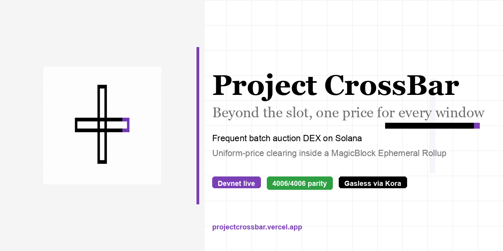
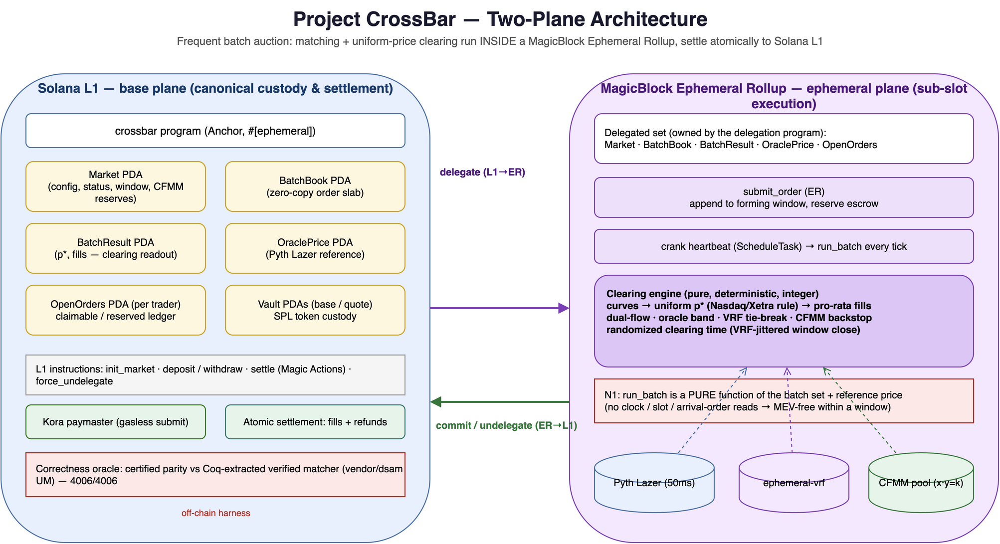
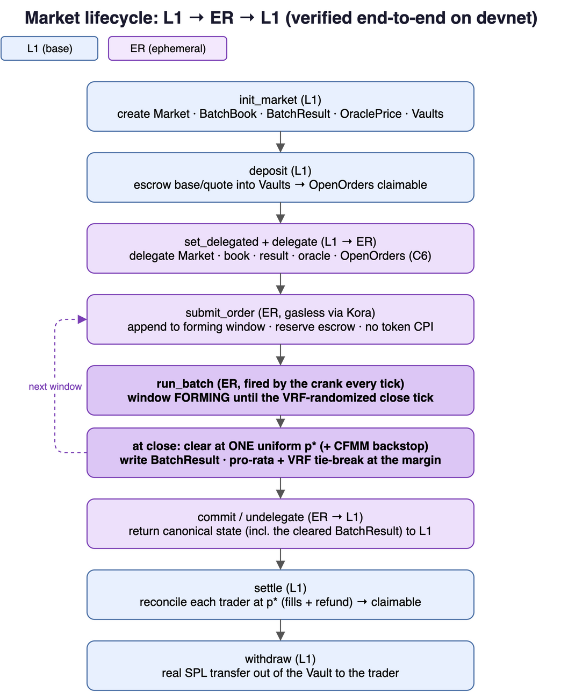

# Project CrossBar

<picture>
  <source media="(prefers-color-scheme: dark)" srcset="docs/github-banner.png">
  
</picture>

> A frequent batch auction (FBA) DEX whose order matching and uniform-price clearing run **inside a MagicBlock Ephemeral Rollup**, then settle atomically to Solana L1.

[](clearing/)
[](tests/parity/)
[](#verification)
[](https://projectcrossbar.vercel.app)
[](LICENSE)

*Research-backed clearing:* uniform-price batch auctions with Nasdaq call-auction pricing ([arXiv:1407.4512](https://arxiv.org/abs/1407.4512)), VRF-randomized window close ([arXiv:2405.09764](https://arxiv.org/abs/2405.09764)), and CFMM-augmented liquidity ([arXiv:2210.04929](https://arxiv.org/abs/2210.04929)) — matcher checked against a verified Coq oracle ([arXiv:2104.08437](https://arxiv.org/abs/2104.08437)). Citations and proofs in [`MATH.md`](MATH.md).

Continuous order books on Solana leak value to whoever lands first in a slot. Project CrossBar removes intra-batch time priority: every order that arrives inside the same window clears at **one uniform price**, the matching runs **sub-slot inside an Ephemeral Rollup** so the protocol controls sequencing instead of the block leader, and the net result settles back to L1 in **one atomic step**.

> **Name.** A *crossbar switch* is a matrix fabric that connects any input to any output in a single pass — exactly what a matching engine does crossing N buyers against N sellers. In market microstructure, *the cross* is the auction print itself: the single uniform price at which aggregated supply and demand meet (the opening/closing cross).

---

## Architecture

Two planes. Custody and settlement are canonical on Solana L1; matching and clearing execute in the ephemeral rollup and commit back.



The novelty is the **execution layer**, not the auction idea. Three accelerator DEXs already do batch/intent auctions on base Solana L1 (Archer — Dual Flow Batch Auctions; URANI — intent batch auctions; Darklake — zkAMM). **None run the clear inside an Ephemeral Rollup.** CrossBar's edge: sub-slot batched matching + uniform clearing with protocol-controlled ordering, then L1 settlement after undelegation.

### Lifecycle

The full path is verified end-to-end on devnet — the auction clears *inside* the rollup, then undelegates and settles on L1.




See [`MATH.md`](MATH.md) for the auction mathematics (LaTeX) and [`TECHNICALDESIGN.md`](TECHNICALDESIGN.md) for the account model diagram.

### Clearing pipeline

`run_batch` is a **pure, deterministic** function of the batch set and the reference price (invariant **N1**). No clock, slot, or arrival-order reads inside matching — determinism *is* the MEV guarantee.


---

## Feature matrix

| Capability | What it does | Where |
| --- | --- | --- |
| **Uniform-price clearing** | Every matched order in a window trades at one `p*` | [`clearing/src/clear.rs`](clearing/src/clear.rs) |
| **Dual-flow (maker/taker)** | Maker priority at the margin, single price preserved | [`clearing/src/clear.rs`](clearing/src/clear.rs) |
| **Canonical call-auction rule** | `p*` by Nasdaq/Xetra cross: max volume → min imbalance → pressure → Pyth ref | [`clearing/tests/auction_price.rs`](clearing/tests/auction_price.rs) · arXiv 1407.4512 |
| **Randomized clearing time** | VRF-jittered window close defeats "bang the close" sniping; N1-clean | [`clearing/src/window.rs`](clearing/src/window.rs) · arXiv 2405.09764 |
| **CFMM backstop** | Constant-product pool folded in as a synthetic maker ladder so thin books still clear | [`clearing/src/cfmm.rs`](clearing/src/cfmm.rs) · arXiv 2210.04929 (EC'24) |
| **Oracle band gate** | Reject `p*` outside Pyth `[p_ref ± δ]`, skip on stale feed | [`clearing/src/band.rs`](clearing/src/band.rs) |
| **VRF tie-break** | Randomness touches *only* the indivisible marginal remainder | [`programs/crossbar/src/lib.rs`](programs/crossbar/src/lib.rs) |
| **Integer fixed-point** | No floating point anywhere; `PRICE_SCALE = 1e6` | whole codebase |
| **Gasless submit** | Kora paymaster sponsors order submission | [`kora/`](kora/) |
| **ER round-trip** | delegate → submit + clear in ER → commit/undelegate → settle | [`tests/er-demo.ts`](tests/er-demo.ts) |
| **Automatic crank + settle keeper** | `ScheduleTask` fires `run_batch` every tick; a minimal keeper then undelegates → settles each trader → finalizes on L1 — full lifecycle in one command | [`tests/crank-demo.ts`](tests/crank-demo.ts) |

Order-fairness (Wendy/Libra) was analyzed and **deliberately not implemented**: FBA set-determinism *subsumes* receive-order fairness (shuffle-invariance is strictly stronger) and a fair-ordering layer would *conflict* with N1. Proven as a theorem test ([`clearing/tests/order_fairness.rs`](clearing/tests/order_fairness.rs)). See [`MATH.md`](MATH.md) §8.2.

> **Settlement is a deliberate two-step.** The auction clears *inside* the ER; settlement
> is a separate **L1 step** driven by a minimal keeper (undelegate → settle each trader →
> finalize) — the same pattern every MagicBlock example uses (e.g. rock-paper-scissor's
> `undelegate_all` → `claim_pot`). It runs end-to-end in one command
> ([`tests/crank-demo.ts`](tests/crank-demo.ts)) and is validated on the devnet ER. (We
> tried to fold settlement into an atomic post-commit Magic Action; the live devnet ER
> disproved same-account commit+action (action escrow never charged). Gasless keeper
> settlement is one Kora paymaster away — UX polish, not a lifecycle change.)

---

## Verification

The correctness definition is **parity with a machine-checked oracle**: the matcher's output must be byte-identical to the Coq-extracted, formally verified double-sided auction matcher (`vendor/dsam` `UM`, rule `mUM.v:131`).

| Property | Evidence | Req |
| --- | --- | --- |
| Certified parity vs extracted OCaml `UM` | **4006/4006 batches** agree on `p*`, volume, fills — `./tests/parity/run_parity.sh` | F12 |
| Single price + IR + conservation, ~30k random books | `clearing/tests/invariants.rs` | N4, F5 |
| Determinism under shuffle, ~30k books | `clearing/tests/invariants.rs` | **N1** |
| Auction rule = verified volume/fills over 20k books | `clearing/tests/auction_price.rs` | — |
| CFMM: parity preserved at zero reserves, k non-decreasing | `clearing/tests/cfmm.rs` | — |
| Full ER round-trip (live MagicBlock ER) | `tests/er-demo.ts` — delegate → clear at `p*` → undelegate → settle | novelty |
| Automatic crank + settle keeper (live ER) | `tests/crank-demo.ts` — ScheduleTask + L1 settle loop | — |
| Scenario A: one uniform price | `tests/demo-devnet.ts` (local) or `tests/er-scenarios.ts` (ER) — `p*=100`, vol 200, 4 fills, ~8k CU | F5, N4 |
| Scenario B: sandwich nets zero | `tests/demo-devnet.ts` (local) or `tests/er-scenarios.ts` (ER) — attacker brackets victim at same `p*` | MEV (MATH §7) |

### Devnet deployment

| Field | Value |
| --- | --- |
| **Program ID** | [`CG4brtfmRvvHLGEfLazSmrTWeUJsDvyKYfosx2Abbzbd`](https://explorer.solana.com/address/CG4brtfmRvvHLGEfLazSmrTWeUJsDvyKYfosx2Abbzbd?cluster=devnet) |
| **Cluster** | Solana devnet + MagicBlock ER (`https://devnet.magicblock.app`) |
| **Last deployed slot** | `469362329` |
| **Program data size** | `692,800` bytes (program account including upgrade buffer) |
| **Upgrade authority** | `8qj2WUdrdByn29yMLPYTwtXQfXCVTt9K1n6Dt7EP9qJ` |
| **Programdata rent** | `4.82` SOL locked in programdata account |
| **Build toolchain** | Anchor 1.0.2, platform-tools **v1.53** (`cargo build-sbf --tools-version v1.53`) |

Verify on-chain:

```bash
solana program show CG4brtfmRvvHLGEfLazSmrTWeUJsDvyKYfosx2Abbzbd --url devnet
```

**What this build contains:**

- `delegate_open_orders` regression fix — removed `market_guard` after `delegate_market` (only reproducible on the real ER, not a local validator)
- `settle_inner` shared helper; round 1/2/3 authorization and idempotency hardening active
- Magic Actions settle-on-undelegate **reverted** (same-account commit+action not dispatched — confirmed on-chain)
- `AlreadySettled`, `FillExceedsReserved`, `OracleDeviation` error codes wired
- Release profile: `opt-level=z`, fat LTO, `strip`, `panic=abort`, `no-log-ix-name` (~150 KB smaller binary), **`overflow-checks=true`**

`run_batch` ≈ 18–21k CU on devnet, far under the 1.4M cap.

### What each demo validates

| Demo | Substrate | Status |
| --- | --- | --- |
| [`tests/er-demo.ts`](tests/er-demo.ts) | Live devnet MagicBlock ER | **Passes** — full delegate → submit → clear → undelegate → settle |
| [`tests/er-scenarios.ts`](tests/er-scenarios.ts) | Live devnet MagicBlock ER | **Passes** — scenarios A/B (uniform `p*`, sandwich) through full ER lifecycle |
| [`tests/crank-demo.ts`](tests/crank-demo.ts) | Live devnet ER + L1 | **Passes** — ScheduleTask crank, then settle keeper (polls L1, settles each trader, finalizes) |
| [`tests/demo-devnet.ts`](tests/demo-devnet.ts) | Local validator (L1 shortcut) | **Passes** — fast regression: clearing math, oracle band, post-audit guards |

> **Validation tiers:** `demo-devnet.ts` is the fast local regression (same matcher
> bytecode, no ER delegation). `er-demo.ts` proves the minimal ER round-trip.
> `er-scenarios.ts` runs the headline A/B demos inside the real ER. `crank-demo.ts`
> adds automatic clearing + the settle keeper.

---

## Live demo

**Web app:** [https://projectcrossbar.vercel.app](https://projectcrossbar.vercel.app)

Cinematic landing page + devnet trading dashboard (dual RPC, Flash reference prices, Kora gasless relay on [Heroku](https://crossbar-kora-devnet-b94b9586c6b7.herokuapp.com)). Connect a devnet wallet and open `/dashboard`.

---

## Quickstart

```bash
# 1. The core matcher — zero-dependency, runs anywhere
cd clearing && cargo test                 # 49 tests across 7 suites

# 2. Certified parity against the verified Coq-extracted oracle
./tests/parity/run_parity.sh              # must print 4006/4006

# 3. Build the on-chain program (platform-tools v1.53 required)
cargo build-sbf --tools-version v1.53
cargo check -p crossbar                   # type-checks against real APIs

# 4. Devnet demos (Node 26 breaks mocha → run standalone with tsx)
export ANCHOR_PROVIDER_URL=https://api.devnet.solana.com
export ANCHOR_WALLET=~/.config/solana/id.json
export EPHEMERAL_PROVIDER_ENDPOINT=https://devnet.magicblock.app/
THROTTLE_MS=900 ./scripts/run-demo-local.sh              # scenarios A + B (local validator, fast)
npx tsx tests/er-scenarios.ts                   # scenarios A + B (live devnet ER)
npx tsx tests/er-demo.ts                        # full ER round-trip (live devnet ER)
npx tsx tests/crank-demo.ts                     # crank + settle keeper (live devnet ER)

# 5. Web dashboard (hero + live devnet panels)
cd web && cp .env.example .env && npm install && npm run dev
# Production: https://projectcrossbar.vercel.app
```

See [`web/README.md`](web/README.md) and [`web/UI_KIT.md`](web/UI_KIT.md) for the React SPA, dual RPC wiring, and design tokens.

> **Toolchain note.** Build the program with platform-tools **v1.53**. v1.51 is too old for the `edition2024` dep tree; v1.54 builds but faults at runtime on Anchor account deserialize. `cargo clean` deletes the program keypair in `target/deploy/` — restore it from `keys/`.

---

## Repository map

```
README.md              overview, diagrams, verification
MATH.md                clearing price (LaTeX), dual-flow, verified-matcher oracle
TECHNICALDESIGN.md     modules, instructions, PDAs, crank, oracle band, account diagrams
docs/diagrams/         draw.io sources + PNGs (`./scripts/render-diagrams.sh`)
SECURITY.md            vulnerability reporting policy
CONTRIBUTING.md        development setup and PR guidelines

clearing/              pure matcher crate (own workspace, zero deps, no_std+alloc)
programs/crossbar/     Anchor program (#[ephemeral])
tests/                 devnet/ER demos (tsx) + parity/ OCaml oracle
scripts/               deploy-devnet.sh · deploy-testnet.sh
docs/diagrams/         drawio sources + rendered PNGs
docs/integrations/     Flash Trade + Private Payments integration designs
clients/flash/         typed Flash Trade REST client
kora/                  gasless paymaster config (secrets gitignored)
web/                   React + Vite SPA (hero + devnet dashboard)
```

See [`TECHNICALDESIGN.md`](TECHNICALDESIGN.md) for the full on-chain instruction surface and account model.

---

## Research grounding

CrossBar layers several peer-reviewed results onto the base FBA, each implemented and tested rather than cited decoratively (citations and the exact mapping are in [`MATH.md`](MATH.md) §8–9):

- **Frequent batch auctions** — Budish, Cramton & Shim, *QJE* 2015 (the case against continuous time priority).
- **Call-auction price rule** — Nasdaq/Xetra opening-cross algorithm, arXiv 1407.4512.
- **Randomized clearing time** — Mastrolia & Xu, arXiv 2405.09764.
- **CFMM-augmented batch clearing** — Ramseyer, Goyal, Goel & Mazières, *EC'24*, arXiv 2210.04929.
- **Price improvement metric** — Bertucci, arXiv 2405.00537.
- **Order-fairness (analyzed, subsumed)** — Wendy (Kursawe, arXiv 2007.08303), Libra (Mavroudis & Melton, arXiv 1910.00321).

---

## Integrations

CrossBar runs inside a MagicBlock Ephemeral Rollup, which makes two adjacent protocols
natural to compose with. Both are source-grounded designs in
[`docs/integrations/`](docs/integrations/) with working code:

- **[Flash Trade V2](docs/integrations/FLASH_TRADE.md)** — a perp DEX that also runs on
  a MagicBlock ER. Typed REST client and WebSocket streaming in [`clients/flash/`](clients/flash/),
  plus a spot/perp hedge demo (`tests/hedge-demo.ts`). Live co-execution requires mainnet on
  both sides; devnet uses API reads with mocked execution.
- **[MagicBlock Private Payments / PER](docs/integrations/PRIVATE_PAYMENTS.md)** — upgrade
  CrossBar's ER to a *Private* ER so resting order sizes and escrow amounts live in a TEE.
  Batching hides *when/in-what-order* you trade; PER hides *how much*. Implemented via
  `make_private` / `make_open_orders_private` ([`programs/crossbar/src/permission.rs`](programs/crossbar/src/permission.rs)),
  demonstrated by [`tests/private-demo.ts`](tests/private-demo.ts).

Settlement follows the standard MagicBlock two-step pattern: clear inside the ER, then
`undelegate_open_orders` + `settle` on L1 (automated in [`tests/crank-demo.ts`](tests/crank-demo.ts)).

> **On N1.** Determinism (N1) is a core invariant — the matcher is a pure function of the
> batch set and reference price. PER confidentiality is orthogonal to it. See [`MATH.md`](MATH.md) §8.

## Security

Authorization gates, one-shot settlement, oracle authentication, and adversarial fuzzing
are documented in [`TECHNICALDESIGN.md`](TECHNICALDESIGN.md). To report vulnerabilities,
see [`SECURITY.md`](SECURITY.md).

## License

[MIT](LICENSE).
