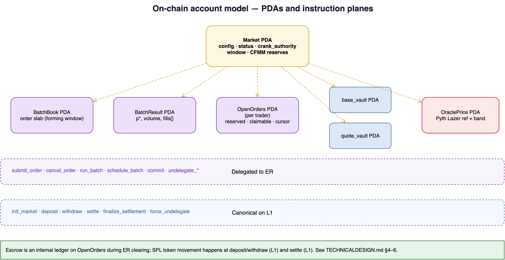
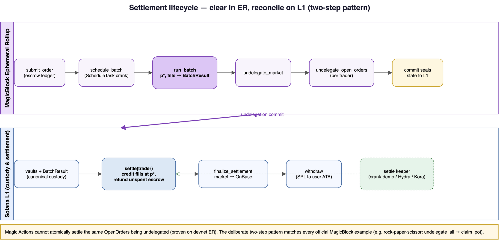
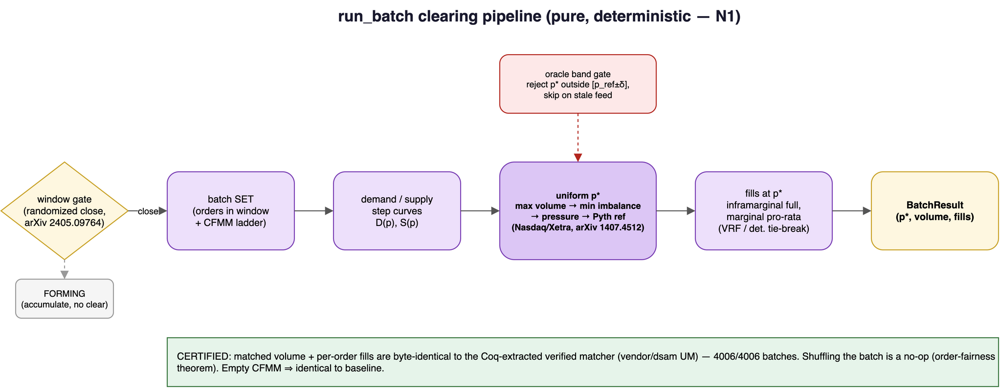

# TECHNICALDESIGN.md - Module and State Design

Module-level design for the Project CrossBar program. This is the bridge between the two-plane architecture and the code. Instruction names and PDA names here are canonical.

Auction mathematics: [`MATH.md`](MATH.md). Diagram sources: [`docs/diagrams/`](docs/diagrams/) (re-render with `./scripts/render-diagrams.sh`).

## Account model



## Settlement lifecycle

Clearing runs in the ER; SPL reconciliation runs on L1 after undelegation. The settle keeper pattern is automated in `tests/crank-demo.ts`.



## 1. Crate and module layout

Single Anchor program, one crate, modules split for readability:

```
programs/crossbar/src/
  lib.rs            program entrypoint, #[ephemeral], instruction handlers
  state/
    market.rs       Market PDA
    book.rs         BatchBook PDA, order record, slab layout
    open_orders.rs  OpenOrders PDA
    result.rs       BatchResult PDA
  clearing/
    curves.rs       demand/supply aggregation
    clear.rs        uniform clearing price, dual-flow crossing
    prorata.rs      marginal pro-rata + VRF tie-break hook
  oracle/
    lazer.rs        Pyth Lazer read + reference band
  rng/
    vrf.rs          ephemeral-vrf request/consume
  settle/
    actions.rs      post-undelegate token movement (Magic Actions)
  err.rs            error codes
```

Keep `clearing/` free of Solana types where possible so the same functions can be unit-tested off-chain and lined up against the verified oracle (`MATH.md` section 6). Pass plain slices and integers in, get fills out.

## 2. Fixed-point and scale

All prices are `u64` in quote units per base unit at a fixed scale. Set `PRICE_SCALE = 1_000_000` (6 decimals of price precision) unless a mint forces otherwise. Quantities are `u64` in base mint atomic units. No floats anywhere in the program or the oracle harness. Document any change to `PRICE_SCALE` here because the oracle fixtures must use the same scale.

## 3. Chosen tick cadence

Tick interval: **50 ms**, aligned to the Pyth Lazer 50ms channel. Rationale: the DFBA reference cadence is ~100ms (Jump writeup), and the Lazer fast channel is 50ms, so 50ms is the tightest defensible cadence that still gets a fresh reference price every tick. The interval is a `Market` field so it can be tuned without a redeploy. Anything in the 50 to 100ms band is acceptable; record the value actually used in the demo.

## 4. Instructions

Signatures are written argument-first; account contexts are summarized. Final account lists follow the delegation and SPL patterns from the MagicBlock SDK and `ephemeral-rollups-spl`.

### 4.1 `init_market(params)` (base L1)

Creates the `Market` PDA and the base/quote `Vault` PDAs. `params`: base mint, quote mint, `tick_interval_ms` (default 50), `band_delta_bps`, `lazer_feed_id`, `fee_bps`, `max_orders_per_batch`. Status set to `OnBase`.

### 4.2 `delegate_market()` (base -> ER)

Delegates `Market`, `BatchBook`, and both `Vault` PDAs into an ER session using the delegation SDK. Sets status `Delegated`. Use `delegate_pda(&payer, &[seeds], DelegateConfig::default())` or the explicit `cpi::delegate_account` form from the SDK. Register the crank here or in a follow-up call (section 5).

### 4.3 `submit_order(side, price_limit, quantity, flow)` (ER)

Validates against `Market`, escrows the maximum spend into the matching `Vault` via `ephemeral-rollups-spl`, writes an order record into `BatchBook` for the forming batch window, and mirrors it into the trader's `OpenOrders`. `flow` is maker or taker (dual-flow tag, M3). Rejects if the forming batch is at `max_orders_per_batch`.

### 4.4 `cancel_order(order_id)` (ER)

Allowed only while the order's batch window is still forming, that is before the tick that will clear it. Removes the record from `BatchBook`, releases escrow back to claimable in `OpenOrders`. Once a window closes for clearing, cancel is rejected.

### 4.5 `run_batch()` (ER, crank only)

The heartbeat. Not user-callable in effect (guard on the crank authority). Steps:



1. Read Pyth Lazer feed, compute reference band. If stale beyond max age, write a skipped `BatchResult` and return.
2. Snapshot orders in the current window from `BatchBook`, split into maker and taker flow.
3. Aggregate demand and supply curves (`clearing/curves.rs`).
4. Compute `p*` (`clearing/clear.rs`). If `p*` outside band, reject the batch.
5. Fill crossing orders at `p*`; pro-rata at margin; VRF tie-break for indivisible remainder.
6. Write `BatchResult`, update `OpenOrders` claimable balances.

`run_batch` must be deterministic given the batch set and the reference price. No reads of clock, slot, or arrival order inside the matching.

### 4.6 `commit()` (ER -> base, periodic)

Calls `commit_accounts` to checkpoint `BatchBook`, `OpenOrders`, and `Vault` to base. Cadence is independent of the tick; checkpoint every N ticks or M milliseconds, set in `Market`.

### 4.7 `undelegate_market()` (ER -> base)

Commits and undelegates the PDAs, returning canonical state to L1. Sets status `Settling`.

### 4.8 `settle()` (base L1)

Runs after undelegation (see settlement diagram above). Moves tokens for recorded fills and refunds unfilled escrow. One-shot per `(trader, window)` via `last_settled_window`. Follow with `finalize_settlement()` to return the market to `OnBase`.

### 4.9 `force_undelegate()` (base, fallback)

L1 escape hatch with a configurable timeout on `Market`. If the ER stalls past the timeout, anyone can trigger undelegation so escrow is never stuck.

## 5. Crank wiring

Register a scheduled task through MagicBlock's scheduling program (CPI) that calls `run_batch` every `tick_interval_ms` inside the ER. The crank authority is the only legitimate caller of `run_batch`; store it on `Market` and check it. See [MagicBlock crank docs](https://docs.magicblock.gg).

## 6. State structs

Bounded and slab-style. Sketch layout:

```rust
// state/market.rs
#[account]
pub struct Market {
    pub base_mint: Pubkey,
    pub quote_mint: Pubkey,
    pub base_vault: Pubkey,
    pub quote_vault: Pubkey,
    pub tick_interval_ms: u32,     // 50
    pub commit_every_ticks: u32,
    pub band_delta_bps: u16,       // reference-band half-width
    pub lazer_feed_id: u64,
    pub fee_bps: u16,
    pub max_orders_per_batch: u16, // slab capacity, fits run_batch CU budget
    pub crank_authority: Pubkey,
    pub status: MarketStatus,      // OnBase | Delegated | Settling
    pub current_window: u64,       // forming batch window id
}

// state/book.rs
pub struct Order {
    pub order_id: u64,
    pub owner: Pubkey,
    pub side: Side,                // Buy | Sell
    pub flow: Flow,                // Maker | Taker
    pub price_limit: u64,          // quote per base, PRICE_SCALE
    pub quantity: u64,             // base atomic units
    pub remaining: u64,
    pub window: u64,               // which batch this belongs to
}

#[account(zero_copy)]
pub struct BatchBook {
    pub market: Pubkey,
    pub window: u64,
    pub n_orders: u16,
    pub orders: [Order; MAX_ORDERS_PER_BATCH], // fixed capacity slab
}

// state/open_orders.rs
#[account]
pub struct OpenOrders {
    pub owner: Pubkey,
    pub market: Pubkey,
    pub base_claimable: u64,
    pub quote_claimable: u64,
    pub live_order_ids: Vec<u64>,  // bounded
}

// state/result.rs
#[account(zero_copy)]
pub struct BatchResult {
    pub market: Pubkey,
    pub window: u64,
    pub status: BatchStatus,       // Cleared | SkippedStaleOracle | RejectedOutOfBand
    pub clearing_price: u64,       // p*
    pub matched_volume: u64,
    pub fills: [Fill; MAX_ORDERS_PER_BATCH], // (order_id, filled_qty)
    pub n_fills: u16,
}
```

Use `zero_copy` for `BatchBook` and `BatchResult` because they are the large fixed-capacity accounts. `OpenOrders` stays a normal account with bounded vecs. `BatchResult` doubles as the differential-test readout (`MATH.md` section 6.1).

## 7. Oracle band

$$
p_{\text{ref}} = \text{Pyth Lazer feed value, scaled to PRICE\_SCALE}
$$

$$
\text{half} = \frac{p_{\text{ref}} \cdot \texttt{band\_delta\_bps}}{10{,}000}
\qquad
\text{band} = [p_{\text{ref}} - \text{half},\; p_{\text{ref}} + \text{half}]
$$

Accept $p^*$ iff $p^* \in \text{band}$ and feed age $\le$ `max_age`. Keep the read tight; it runs every tick. See `programs/crossbar/src/state/oracle.rs`.

## 8. Errors (`err.rs`)

`BatchFull`, `WindowClosed`, `OutOfBand`, `StaleOracle`, `NotCrankAuthority`, `EmptyCross`, `VrfTimeout`. Each maps to a documented failure mode in `MATH.md` §7–8.
