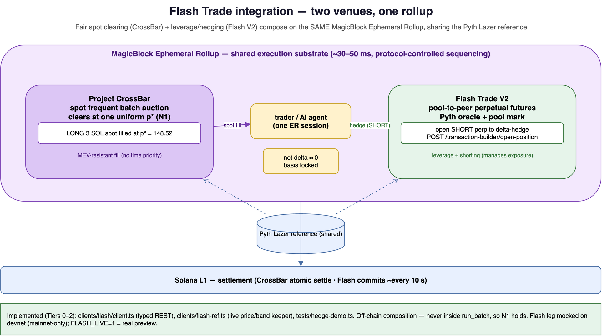

# Integration: Flash Trade (perpetuals on the same rollup)

> **Status: Tiers 0–2 IMPLEMENTED; Tier 3 roadmap.** A typed Flash REST client
> (`clients/flash/client.ts`), a read-only price/liquidity reference keeper
> (`clients/flash-ref.ts`, verified against the **live mainnet** Flash API), and a
> spot/perp hedge demo (`tests/hedge-demo.ts`) are built and run. Every program id,
> endpoint, and method below is taken from the vendored Flash Trade skill
> (`.agents/skills/flash-trade/`) and the public [`flash-trade/examples-v2`](https://github.com/flash-trade/examples-v2)
> repo; nothing here is invented. Because Flash V2 is mainnet-only with real funds while
> CrossBar is devnet, the hedge leg is mocked by default (real preview under `FLASH_LIVE=1`,
> never submitted). See [Honesty notes](#honesty-notes--what-is-not-claimed).

> **Going deeper?** This doc covers the spot/perp thesis + tiers. For the *comprehensive*
> surface — full REST client, WebSocket streaming, MCP/AI-agent wiring, and the
> build-on-Flash feature menu (trailing TP/SL, copy trading, LP dashboards, automated
> strategies) — see [`FLASH_TRADE_FEATURES.md`](FLASH_TRADE_FEATURES.md).

## TL;DR — why these two belong together

Project CrossBar is a **frequent batch auction (spot)** DEX that clears at one uniform
price *inside a MagicBlock Ephemeral Rollup*. Flash Trade V2 is a **pool-to-peer
perpetual futures** DEX that, per its own repo, *also* runs inside a MagicBlock
Ephemeral Rollup:

> "Flash Trade V2 runs perpetual futures on a MagicBlock Ephemeral Rollup — your
> account is delegated to a rollup validator, trades confirm in ~30–50 ms for
> near-zero cost, and state commits back to Solana every 10 s."
> — `flash-trade/examples-v2` README

So the two protocols share **the same execution substrate, the same delegation
lifecycle, and the same oracle family (Pyth Lazer)**. That is the integration: not
forking Flash into CrossBar, but composing a **spot batch venue** and a **perp venue**
that already live on the same rollup, so a trader (or an agent) can clear spot fairly
on CrossBar and hedge the resulting delta on Flash in the same ER session.

| | Project CrossBar | Flash Trade V2 |
| --- | --- | --- |
| Instrument | Spot, uniform-price batch auction | Perpetual futures, pool-to-peer |
| Price formation | Single `p*` per window (Nasdaq/Xetra cross) | Pyth oracle + pool mark |
| Execution venue | MagicBlock ER (devnet) | MagicBlock ER (mainnet) |
| Settlement | Atomic to Solana L1 | Commits to Solana ~every 10 s |
| Oracle | Pyth Lazer (band gate) | Pyth Lazer (200 ms) + Hermes fallback |
| Client | typed TS + `tsx` demos | typed REST client (`packages/flash-v2`, bun) |



## Verified facts (source of truth)

From `.agents/skills/flash-trade/ProtocolConcepts.md` and `SKILL.md`:

| Item | Value |
| --- | --- |
| Perpetuals program (mainnet) | `FLASH6Lo6h3iasJKWDs2F8TkW2UKf3s15C8PMGuVfgBn` |
| Perpetuals program (devnet) | `FTPP4jEWW1n8s2FEccwVfS9KCPjpndaswg7Nkkuz4ER4` |
| Composability program (mainnet) | `FSWAPViR8ny5K96hezav8jynVubP2dJ2L7SbKzds2hwm` |
| Pyth Lazer program | `pytd2yyk641x7ak7mkaasSJVXh6YYZnC7wTmtgAyxPt` |
| REST API base (v1 skill) | `https://flashapi.trade` |
| REST API base (v2 repo) | `https://flashapi.trade/v2` (`openapi.v2.json`, 36 endpoints) |
| ER trading RPC (V2) | `https://flash.magicblock.xyz` |
| Model | Pool-to-peer; no orderbook; trades fill against shared LP pools |
| Network reality | Pyth prices are **mainnet only**; devnet returns stale/zero |

The build/sign/submit flow is identical in shape to how CrossBar already drives the
ER: the API returns an **unsigned** `VersionedTransaction` as `transactionBase64`, the
client signs and submits (`.agents/skills/flash-trade/TransactionFlow.md`). CrossBar's
`tests/*.ts` already do exactly this against the MagicBlock ER, so the client plumbing
is shared muscle.

## Integration tiers

Ordered by how much can be done **today** vs. what is roadmap. Each tier is
independently shippable.

### Tier 0 — Flash as an independent price/liquidity reference ✅ IMPLEMENTED (`clients/flash-ref.ts`)

CrossBar's `run_batch` already gates `p*` against a Pyth reference band
(`clearing/src/band.rs`). Flash exposes the *same* underlying assets priced off the
same Pyth Lazer feed, plus pool depth. A keeper can pull Flash's public, no-auth REST
data as a **second, independent sanity signal** for the band and for analytics — never
inside `run_batch` (that would break N1), only in the off-chain keeper that pushes
`update_reference_price`.

```ts
// SKETCH — off-chain keeper, not on-chain. Read-only, no wallet.
// Verified endpoints: GET /prices, GET /pool-data  (.agents/skills/flash-trade/SKILL.md)
const prices = await fetch("https://flashapi.trade/prices").then(r => r.json());
const pools  = await fetch("https://flashapi.trade/pool-data").then(r => r.json());
// Cross-check CrossBar's Pyth push against Flash's mark before update_reference_price.
// If they diverge beyond δ, widen the band or skip the window (fail safe).
```

**Why it's safe:** read-only, off-chain, advisory. It strengthens the oracle band
without touching the pure matcher. The "mainnet" contact is a **read-only HTTP GET of
Flash's public price API** — no wallet, no Solana RPC, no funds (like loading a JSON
webpage). For a strictly devnet-only / air-gapped run, `FLASH_OFFLINE=1` skips the
network entirely and uses a fixture mark, so the cross-check arithmetic still runs with
**zero mainnet contact** (also protects a live demo if the public API is unreachable):

```bash
npx tsx clients/flash-ref.ts                                   # live public read
FLASH_OFFLINE=1 FLASH_FIXTURE_PRICE=150 npx tsx clients/flash-ref.ts   # zero network
```

## Recommended stack: CrossBar devnet, Flash mainnet-side companion

The honest, defensible configuration (no real funds anywhere — there is **no mainnet
transaction** in this repo: no wallet, no signing, no submit, no mainnet RPC):

| Piece | Where it runs | Funds at risk |
| --- | --- | --- |
| CrossBar (core: deploy, ER round-trip, demo A/B, crank) | **devnet** | none |
| Flash Tier 0 keeper (price/band cross-check) | read-only HTTP to public Flash API (or `FLASH_OFFLINE=1`) | none |
| Flash Tier 2 hedge demo | mocked by default | none |
| Flash `FLASH_LIVE=1` | real API **preview only** (owner omitted → no tx) | none |

**Pitch:** *"CrossBar runs and is verified on devnet inside a MagicBlock ER. The Flash
integration is composition: we read Flash mainnet prices to sanity-check the oracle band,
and demonstrate the spot→perp hedge flow with mocked Flash responses. Live co-execution
needs CrossBar on mainnet — roadmap, not a blocker for the core auction proof."*

**What we deliberately do NOT do** (and why a real devnet trade is the wrong move): submit
real Flash txs on devnet (Pyth is stale/zero there → garbage prices), claim live spot+perp
co-execution (networks don't match), or CPI CrossBar→Flash on-chain (not designed; would
break the honesty contract). Flash's devnet *programs* exist but there is no usable devnet
*market* — so devnet Flash is not a serious trading environment, and the integration never
pretends otherwise.

### Tier 1 — Typed Flash client, reusing the examples-v2 patterns ✅ IMPLEMENTED (`clients/flash/client.ts`)

`flash-trade/examples-v2` is a clean, bun-based, dependency-light template that solves
problems CrossBar's own client also has. Worth adopting wholesale:

| examples-v2 piece | What CrossBar borrows it for |
| --- | --- |
| `packages/flash-v2` (typed REST client, "edit to add endpoints") | A typed CrossBar client wrapping our ix builders instead of raw `@coral-xyz/anchor` calls |
| `tap-trade` (session keys + live WebSocket state, latency HUD) | One-tap order submission to CrossBar's ER with a ~30–50 ms confirmation HUD |
| `copy-trade` (snapshot diffing, proportional sizing) | Mirroring/replay of CrossBar batches for demos and for a "follow the cross" UX |
| `_template` | Starter for third parties building on CrossBar |
| `lifecycle.ts` (two-chain account walkthrough, dry-run) | A canonical CrossBar delegate→submit→clear→undelegate→settle walkthrough |

The **session-key pattern** in `tap-trade` is the most valuable: it lets a user
pre-authorize ER-side actions so each order doesn't need a wallet popup — exactly the
UX a sub-slot batch venue wants, and it composes with CrossBar's Kora gasless paymaster.

### Tier 2 — Spot/perp hedging in one ER session ✅ IMPLEMENTED (`tests/hedge-demo.ts`)

The real composability: a trader clears spot on CrossBar and **delta-hedges on Flash**,
both inside MagicBlock, sharing the Pyth Lazer reference so the two legs price
consistently.

```
CrossBar window closes → trader filled LONG 3 SOL spot at p* = 148.52
                                  │  (same Pyth Lazer reference price)
                                  ▼
Flash: POST /transaction-builder/open-position
       { inputTokenSymbol:"USDC", outputTokenSymbol:"SOL",
         inputAmountUi:"…", leverage:…, tradeType:"SHORT", owner:<wallet> }
                                  ▼
       sign transactionBase64 → submit → trader is delta-neutral, basis locked
```

This is genuinely additive: CrossBar gives a **fair, MEV-resistant spot fill**; Flash
gives **leverage and shorting** to manage the resulting exposure — neither protocol can
do the other's job, and they sit on the same rollup so latency is symmetric.

**Honest caveat:** Flash V2 is mainnet-only with real funds; CrossBar is devnet today.
A *live* combined session therefore waits on a CrossBar mainnet/ER deployment. Until
then this tier is demonstrated with Flash on mainnet + CrossBar on devnet side-by-side,
or mocked Flash responses in a `tsx` demo.

### Tier 3 — Residual delta routing (roadmap, cautious)

When a CrossBar window leaves a marginal remainder unfilled (thin book, even after the
CFMM backstop), the *protocol* could expose that residual delta to a keeper that hedges
it on Flash, so a maker isn't left with unwanted inventory. This is **delta hedging of a
residual, not "filling spot on a perp venue"** — the instruments differ, so we never
claim a CrossBar spot order is "executed on Flash." Framed correctly it is a
risk-management convenience, not a clearing path, and must never feed back into
`run_batch` (N1).

## Where it touches CrossBar's code (if/when built)

- **Off-chain only for Tier 0/1**: a new `clients/` (typed client) + keeper module
  reading Flash REST. No program change. No `run_batch` change. N1 untouched.
- **Tier 2**: a client-side orchestrator that, after `settle`, optionally builds a Flash
  hedge tx. Still no CrossBar program change — composition happens in the wallet/agent.
- **No cross-program CPI is proposed.** Flash's own atomic multi-step flows go through
  its Composability program (`FSWAPViR8ny5K96hezav8jynVubP2dJ2L7SbKzds2hwm`); CrossBar
  does not call into Flash on-chain and does not need to.

## Demo plan

1. `clients/flash-ref.ts` — Tier 0 keeper: print Flash `/prices` + `/pool-data` next to
   CrossBar's Pyth push; show the band cross-check. (Runs today, read-only.)
2. `tests/hedge-demo.ts` — Tier 2: clear a CrossBar window on devnet, then build (and on
   mainnet, submit) an offsetting Flash `open-position` SHORT; print the resulting net
   delta and the shared reference price. Flash leg mocked on devnet, real on mainnet.
3. Adopt `tap-trade`'s latency HUD around CrossBar `submit_order` to visualise the
   ~30–50 ms ER confirmation both venues share.

## Honesty notes — what is *not* claimed

- CrossBar does **not** embed, fork, or CPI into Flash Trade. They compose at the
  client/agent layer on a shared rollup.
- Flash V2 is **mainnet, real funds**; CrossBar is **devnet**. No live co-execution is
  claimed until CrossBar deploys to the same network.
- Perps ≠ spot. CrossBar never routes a spot fill *as* a perp; Tier 3 is delta hedging.
- Nothing here runs inside `run_batch`. The matcher stays a pure, deterministic function
  of the batch set + reference price (**N1**); Flash data only ever informs the
  off-chain oracle keeper or post-settlement client actions.
- All identifiers are quoted from `.agents/skills/flash-trade/` and the public examples-v2 repo;
  the v1 (`https://flashapi.trade`) vs v2 (`https://flashapi.trade/v2`) base URLs differ
  and are both recorded above rather than guessed.

## References

- Vendored skill: [`.agents/skills/flash-trade/`](../../.agents/skills/flash-trade/) — `SKILL.md`,
  `ApiReference.md`, `TransactionFlow.md`, `ProtocolConcepts.md`, `SdkReference.md`,
  `McpIntegration.md`, `ErrorReference.md`, `WebSocketStreaming.md`.
- Public examples: <https://github.com/flash-trade/examples-v2>
- Docs: <https://docs.flash.trade/>
