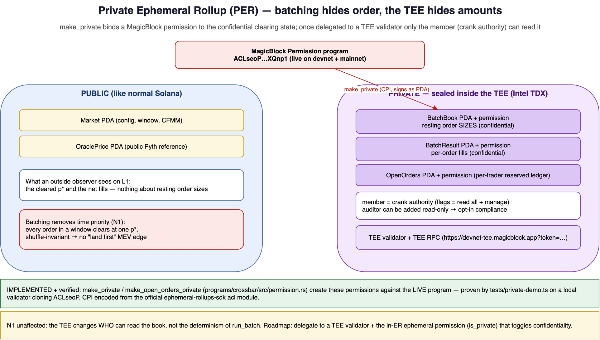

# Integration: MagicBlock Private Payments / Private Ephemeral Rollups (PER)

> **Status: PARTIALLY IMPLEMENTED + verified.** The L1-side base-permission step is
> built and runs against the **live** MagicBlock permission program: `make_private`
> and `make_open_orders_private` in `programs/crossbar/src/lib.rs` (+ `permission.rs`)
> create permissions over the BatchBook, BatchResult, and per-trader OpenOrders. Proven
> end-to-end by `tests/private-demo.ts` against a local validator that **clones the real
> `ACLseoP…` program from devnet** (`./scripts/run-private-demo-local.sh`) — the
> permissions are created and owned by the permission program. The remaining work
> (delegating that set to a TEE validator + the in-ER *ephemeral* permission that
> actually toggles privacy) is roadmap and called out in [Step C](#step-c--client-points-at-the-tee-rpc).
> Every program id, endpoint, validator, and flag below is quoted from MagicBlock docs
> and the `ephemeral-rollups-sdk` CrossBar already depends on; the CPI encoding is from
> that SDK's `acl` module, which targets the live program (verified). See
> [Honesty notes](#honesty-notes).

## Why this is the most *native* extension CrossBar can take

CrossBar already runs on a MagicBlock Ephemeral Rollup, and it already uses the exact
infrastructure that Private Payments builds on:

| Thing CrossBar already uses | Same thing PER builds on |
| --- | --- |
| Delegation program `DELeGGvXpWV2fqJUhqcF5ZSYMS4JTLjteaAMARRSaeSh` | PER delegates via the **same** delegation program |
| ER validator `MAS1Dt9qreoRMQ14YQuhg8UTZMMzDdKhmkZMECCzk57` (Asia) | One of the documented PER/ER validators (US `MUS3…`, EU `MEUGG…`, Asia `MAS1…`) |
| `ephemeral-rollups-sdk` delegate/commit/undelegate CPIs | PER access control is exposed through the **same SDK's CPIs** |
| `#[ephemeral]` program + delegated PDA set | A **Private** ER is the same delegated set + an `EphemeralPermission` account |

A Private Ephemeral Rollup (PER) is "an Ephemeral Rollup whose state is shielded inside
a Trusted Execution Environment (Intel TDX)." Turning CrossBar's ER into a *Private* ER
is therefore not a rewrite — it is **adding a permission account over the PDAs CrossBar
already delegates**, and pointing the client at the TEE RPC.

## The thesis: batching hides *order*, PER hides *amounts*

CrossBar's MEV resistance comes from **set-determinism**: every order in a window clears
at one `p*`, and `run_batch` is invariant to arrival order (N1). That removes
*ordering/time-priority* leakage. But two things are still public on a vanilla ER:

1. **Order sizes** sitting in the `BatchBook` while a window is forming.
2. **Escrow deposit/withdraw amounts** crossing the L1 boundary.

A large, *visible* resting order can be gamed *across* windows even if it's safe *within*
one. Private Payments closes exactly that gap. Combined:

> **Batching hides when/in-what-order you traded. PER hides how much you traded and with
> whom. Together: information-leakage defense in depth, opt-in and auditable.**



This is complementary, not redundant — and crucially it does **not** touch the matcher.
`run_batch` is still the same pure function; it just executes over inputs the TEE keeps
confidential. N1 is preserved (a TEE changes *who can see* the state, not the
*determinism* of the function over it).

## Verified facts (source of truth)

From `docs.magicblock.gg/pages/private-ephemeral-rollups-pers/…`:

| Item | Value |
| --- | --- |
| Permission program | `ACLseoPoyC3cBqoUtkbjZ4aDrkurZW86v19pXz2XQnp1` |
| Delegation program | `DELeGGvXpWV2fqJUhqcF5ZSYMS4JTLjteaAMARRSaeSh` (CrossBar already uses this) |
| ER validators | US `MUS3hc9TCw4cGC12vHNoYcCGzJG1txjgQLZWVoeNHNd` · EU `MEUGGrYPxKk17hCr7wpT6s8dtNokZj5U2L57vjYMS8e` · Asia `MAS1Dt9qreoRMQ14YQuhg8UTZMMzDdKhmkZMECCzk57` |
| Confidential SPL program | `ephemeral-spl-token` (github.com/magicblock-labs/ephemeral-spl-token) |
| Permission CPI source of truth | `ephemeral-rollups-sdk` `acl` module (`rust/pinocchio/src/acl/`) — targets the live program |
| `create_permission` encoding | u64-LE discriminator `0`, accounts `[permissioned (signer), permission (w), payer (ws), system]`, args `MembersArgs` |
| Hosted Private Payments API (mainnet) | `https://payments.magicblock.app` |
| TEE | Intel TDX; "a trusted execution environment acts as a vault inside a CPU" |
| TEE RPC (devnet) | `https://devnet-tee.magicblock.app?token=<authToken>` |
| TEE attestation | verify via `https://pccs.phala.network/tdx/certification/v4` |
| Privacy default | "Every account is public by default, like in Solana"; opt-in shielding |
| Confidential transfers | "move assets privately without exposing balances or counterparties" |
| Transaction splits | up to 15 splits to further obscure volume |

> ⚠️ **Correction (learned the hard way).** An earlier draft used a `CreateGroup` +
> single-byte-discriminator layout taken from the `private-payments-demo` starter-kit's
> auto-generated client. That client targets the kit's **local test fixture**
> (`BTWAq…`, `tests/fixtures/permission.so` in its `Anchor.toml`), **not** the live
> program — and the live `ACLseoP…` program rejected it on-chain with *"invalid
> instruction data."* The live program has **no group concept**: it is a single
> `create_permission` whose discriminator is a **u64** and whose args are `MembersArgs`.
> The encoding above is from the official `ephemeral-rollups-sdk` `acl` module and is
> verified to execute (see `programs/crossbar/src/permission.rs`).

### Access-control model (`Permission` → `EphemeralPermission`)

There are two layers (both in `acl/types.rs`):

1. **Base `Permission`** — created on L1 by `create_permission` over a (not-yet-delegated)
   account. Carries the permissioned account + a member list. This is what CrossBar's
   `make_private` creates today.
2. **In-ER `EphemeralPermission`** — created/updated inside the rollup (`create_ephemeral_permission`,
   discriminator `6`; needs the magic program + vault) and carries the `is_private` flag
   that actually toggles TEE confidentiality. This is the roadmap step that runs *after*
   delegating to a TEE validator.

Both use the same **Member Flags** bitmask (verified `acl/types.rs::MemberFlags`):

| Flag | Bit | Capability |
| --- | --- | --- |
| `AUTHORITY` | `1<<0` | update/delegate permissions, add/remove members |
| `TX_LOGS` | `1<<1` | view transaction execution logs |
| `TX_BALANCES` | `1<<2` | view account balance changes |
| `TX_MESSAGE` | `1<<3` | view transaction message data |
| `ACCOUNT_SIGNATURES` | `1<<4` | view account signatures |

CrossBar grants the crank authority **all five** (`0b11111`) so it can read the
confidential book to clear/settle and manage the member list.

- `is_private: true` (ephemeral layer) → only listed members can decrypt/read ER state via the TEE.
- `is_private: false` + empty member list → fully public (vanilla ER behaviour).
- Operations: **Create**, **Update** (toggle privacy, add/remove members, change flags —
  takes effect *without* undelegating), **Close**.

### Confidential SPL REST surface (`/v1/spl/…`)

The Private Payments API mirrors CrossBar's existing "build unsigned tx → sign →
submit" pattern:

| Endpoint | Purpose |
| --- | --- |
| `GET /v1/spl/challenge?pubkey=<wallet>` | get a challenge string |
| `POST /v1/spl/login` | exchange signed challenge for a bearer token |
| `deposit` / `withdraw` | move SPL between Solana base and the PER |
| `transfer` (public or **private**) | confidential SPL transfer |
| `quote` / `swap` | private swap (pass-through or scheduled-transfer); supports Jupiter V6 |
| `balance` / `private-balance` | public vs. TEE-private balance |
| `initialize-mint` / `is-mint-initialized` | confidential-mint setup |
| `mcp` | agent integration surface |

Unsigned-tx response shape (identical pattern to CrossBar's ER txs and to Flash):
`{ kind, version, transactionBase64, sendTo, recentBlockhash, lastValidBlockHeight,
instructionCount, requiredSigners }`.

## How CrossBar would adopt PER

### Step A — bind base permissions to the clearing state ✅ IMPLEMENTED

CrossBar delegates `Market`, `BatchBook`, `BatchResult`, `OpenOrders` (per `REQUIREMENTS.md`
C6) before the first tick. `make_private` (`programs/crossbar/src/lib.rs`) creates a base
`Permission` over the confidential clearing accounts — `BatchBook` (resting sizes) and
`BatchResult` (per-order fills) — listing the crank authority as the reading member.
`make_open_orders_private` does the same for a trader's reserved ledger. The hand-rolled
CPI (`permission.rs`) is encoded from the official `ephemeral-rollups-sdk` `acl` module:

```rust
// programs/crossbar/src/permission.rs — verified against the LIVE ACLseoP… program.
// create_permission: u64-LE discriminator 0, then MembersArgs.
// Accounts: [permissioned (signer), permission (writable), payer (ws), system].
// The permissioned account signs via its PDA seeds (invoke_signed), so this runs
// BEFORE delegation while the program still owns the PDA.
let members = [(permission::FLAGS_ALL, market.crank_authority)];
invoke_signed(
    &permission::create_permission_ix(
        ctx.accounts.book.key(),            // permissioned account (signs)
        ctx.accounts.book_permission.key(), // ["permission:", book] PDA
        payer, sys, &members,
    ),
    &[/* book, book_permission, payer, system */],
    &[&[BOOK_SEED, market_key.as_ref(), &[ctx.bumps.book]]],
)?;
```

Verified end-to-end by `tests/private-demo.ts` against a local validator cloning the real
`ACLseoP…` program: the `book`/`result`/`open_orders` permission PDAs are created and owned
by the permission program. Run it: `./scripts/run-private-demo-local.sh`.

The base permission establishes *who* may read each account. The privacy itself is
toggled by the in-ER `EphemeralPermission` (`is_private`), which is the [Step C](#step-c--client-points-at-the-tee-rpc)
roadmap step (needs delegation to a TEE validator + the magic program in-ER).

The matcher does not change. `run_batch` reads the (now TEE-confidential) `BatchBook`
exactly as before; the difference is that an outside observer cannot see resting sizes
during the forming window, so cross-window size-signal gaming is removed.

### Step B — confidential escrow at the L1 boundary

Route `deposit` / `withdraw` through `ephemeral-spl-token` confidential transfers so the
*amount* a trader brings to or takes from CrossBar is hidden, with **up to 15
transaction splits** on withdrawal to obscure volume. This complements Step A: sizes are
hidden both at rest (in the book) and in motion (at the boundary).

### Step C — client points at the TEE RPC

```ts
// SKETCH — client auth + private RPC. Verified flow (PER quickstart).
const challenge = await fetch(`${PER}/v1/spl/challenge?pubkey=${wallet.publicKey}`).then(r => r.text());
const sig = signMessage(challenge, wallet);
const { token } = await fetch(`${PER}/v1/spl/login`, { method: "POST", body: sig }).then(r => r.json());
// 1. verify TEE integrity: https://pccs.phala.network/tdx/certification/v4
// 2. talk to the private rollup:
const connection = new Connection(`https://devnet-tee.magicblock.app?token=${token}`);
// submit_order / run_batch / settle flow is otherwise unchanged.
```

### Step D — opt-in compliance

Add a regulator/auditor as a member with **only** `TX_BALANCES` (not `AUTHORITY`). They
can audit cleared volume without being able to trade, move funds, or change the member
list — "compliant by default, privacy by consent." Member changes take effect without
undelegating.

## Why this raises the project's standing

- **A genuinely novel combination.** Three accelerator DEXs do batch/intent auctions on
  base L1; none run the clear *inside* an ER (CrossBar's existing novelty). Adding PER
  makes it a batch auction that is *both* MEV-resistant (batching) *and*
  size-confidential (TEE) — a combination not present in the prior art in `PROPOSAL.md`.
- **Native, low-risk — and now demonstrated.** Same delegation program, same ER validator
  family, same SDK. The base-permission step is *implemented* and runs against the live
  permission program with no new program dependency and a clean SBF build; the change is
  additive (`make_private` + TEE RPC), not a rewrite.
- **Agent + gasless + private** stack: CrossBar's Kora gasless submit + PER's
  agent-friendly private transfers = AI agents trading fairly *and* confidentially.
- **No conflict with the invariants.** TEE confidentiality is orthogonal to N1: the
  matcher remains a pure deterministic function; only state *visibility* changes.

## Honesty notes

- **What's shipped vs. roadmap.** The L1 base-permission step (`make_private`,
  `make_open_orders_private`) IS implemented and verified against the live `ACLseoP…`
  program (local validator cloning it). What is NOT yet built: delegating the
  permissioned set to a **TEE validator** and creating the in-ER `EphemeralPermission`
  (`is_private`) that actually shields the state — that needs the magic program in-ER and
  is the next step. So the access-control plumbing is real; the TEE confidentiality is the
  documented remainder.
- **The fixture-vs-live trap, recorded.** The first attempt encoded the CPI from the
  starter-kit's generated client (`CreateGroup`, 1-byte discriminator) and was rejected
  on-chain because that client targets the kit's local fixture, not the live program. The
  shipped code uses the official `ephemeral-rollups-sdk` `acl` encoding. Lesson: a
  generated client is only as authoritative as the program id it was generated against.
- **Trust assumption.** PER privacy rests on Intel TDX hardware — "a trust assumption in
  vendor hardware," per MagicBlock's own docs. That tradeoff (vs. ZK/MPC) should be
  stated to judges/users, not hidden.
- **N1 is preserved, and re-verified.** Making state private changes who can read the
  book, not the determinism of `run_batch`; `clearing/tests/invariants.rs` shuffle-
  invariance still passes (49/49). See `docs/N1_INVESTIGATION.md` for why even a
  TEE-attested sequencer does not justify relaxing N1 for the batch clear.
- **Confidential escrow (Step B) is still design.** `ephemeral-spl-token` instruction
  signatures and the Mirage CLI are referenced by MagicBlock but not reproduced verbatim;
  pull them from `github.com/magicblock-labs/ephemeral-spl-token` before writing those CPIs.
- All program ids, validators, flags, and endpoints above are quoted from MagicBlock's
  published docs / the official SDK; the delegation program, `MAS1…` validator, and the
  `ACLseoP…` permission program are independently confirmed (the last is live on devnet +
  mainnet and was exercised by the demo).

## References

- PER introduction & on-chain privacy:
  <https://docs.magicblock.gg/pages/private-ephemeral-rollups-pers/introduction/onchain-privacy>
- Quickstart:
  <https://docs.magicblock.gg/pages/private-ephemeral-rollups-pers/how-to-guide/quickstart>
- Access control:
  <https://docs.magicblock.gg/pages/private-ephemeral-rollups-pers/how-to-guide/access-control>
- API reference (`/v1/spl/*`):
  <https://docs.magicblock.gg/pages/private-ephemeral-rollups-pers/api-reference/per/introduction>
- Confidential SPL program: <https://github.com/magicblock-labs/ephemeral-spl-token>
- Hosted Private Payments API: `https://payments.magicblock.app`
- Local MagicBlock dev skill: [`.agents/skills/magicblock/private-payments.md`](../../.agents/skills/magicblock/private-payments.md)
  (full REST surface, auth flow, response shapes).
- **CPI source of truth (live program):** `vendor/ephemeral-rollups-sdk/rust/pinocchio/src/acl/`
  (`consts.rs`, `types.rs`, `utils.rs`, `instruction/create_permission.rs`).
- In-repo implementation: [`programs/crossbar/src/permission.rs`](../../programs/crossbar/src/permission.rs),
  `make_private` / `make_open_orders_private` in `lib.rs`, [`tests/private-demo.ts`](../../tests/private-demo.ts),
  [`scripts/run-private-demo-local.sh`](../../scripts/run-private-demo-local.sh).
- Starter-kit demo (note: its generated client targets a LOCAL fixture, not the live
  program): [`vendor/starter-kits/private-payments-demo`](../../vendor/starter-kits/private-payments-demo).
